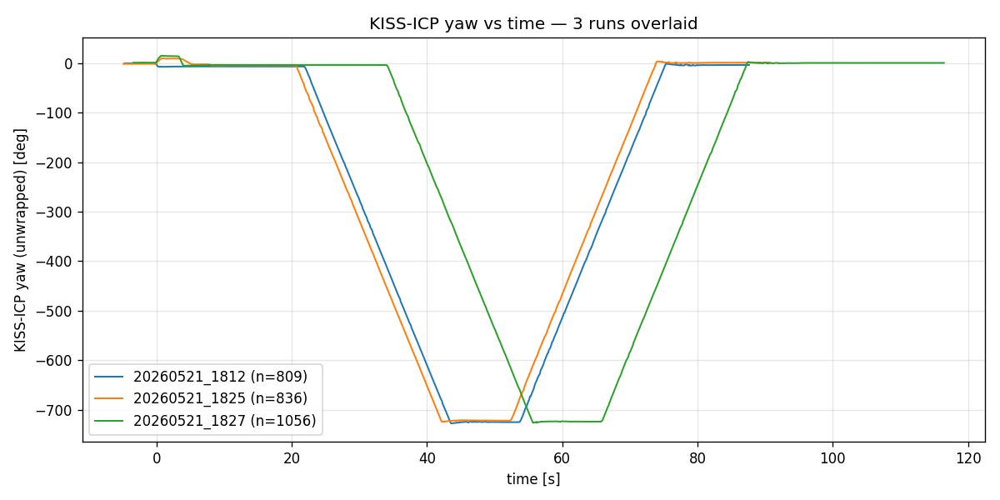
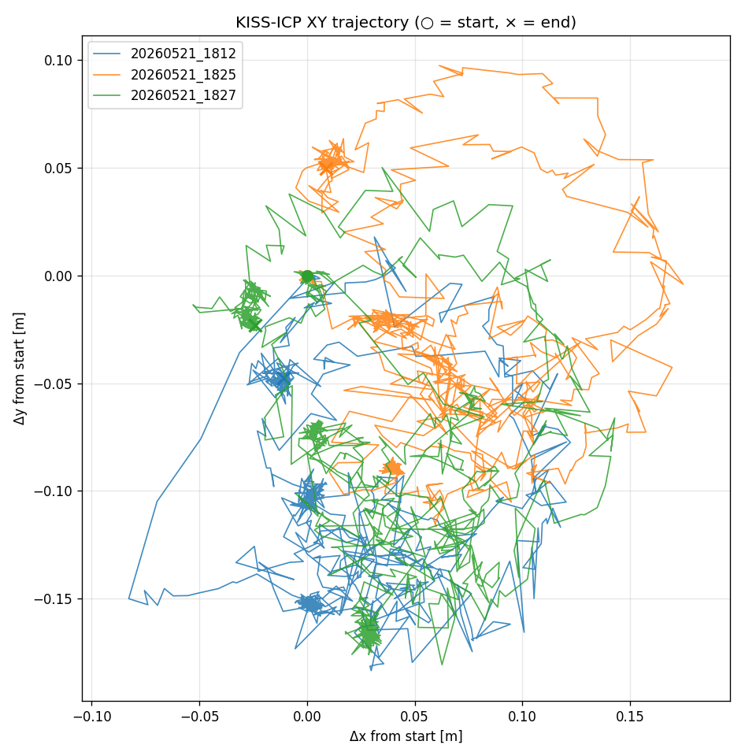
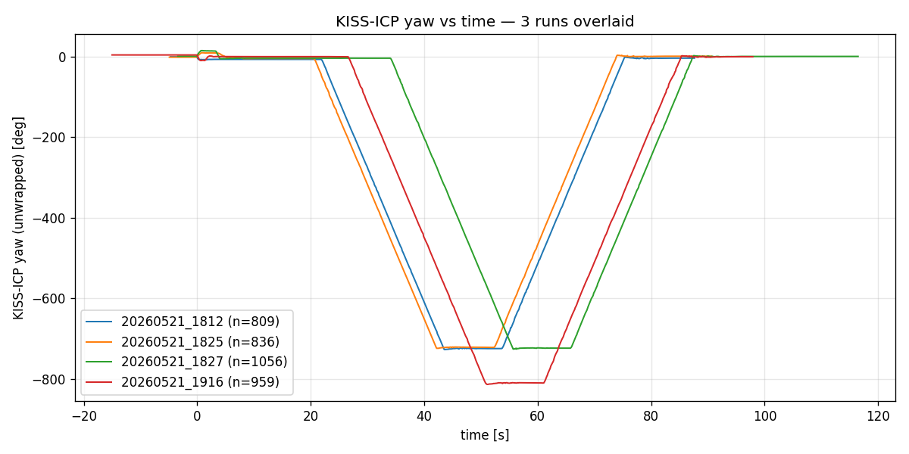
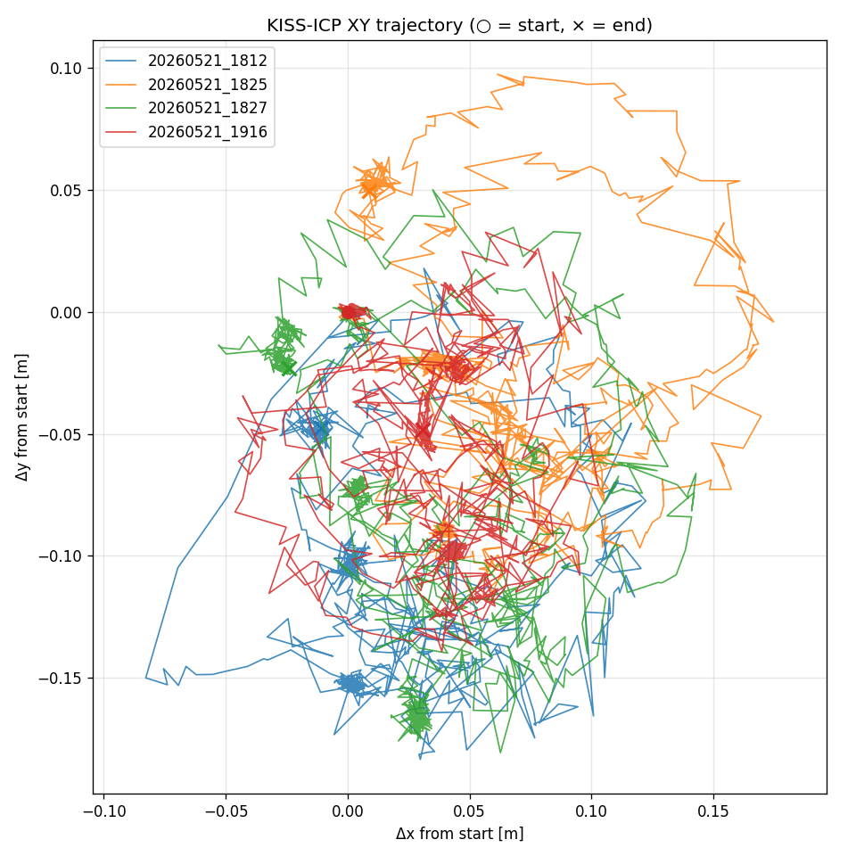
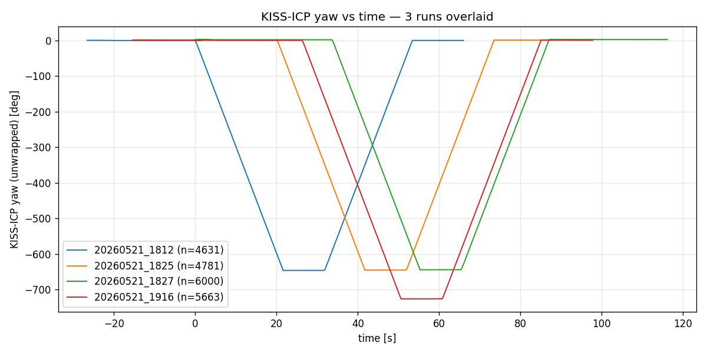
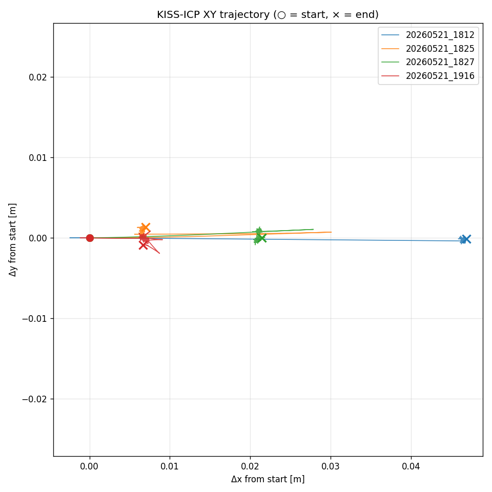
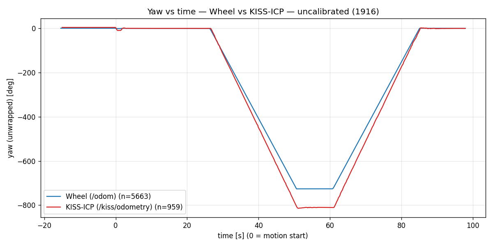
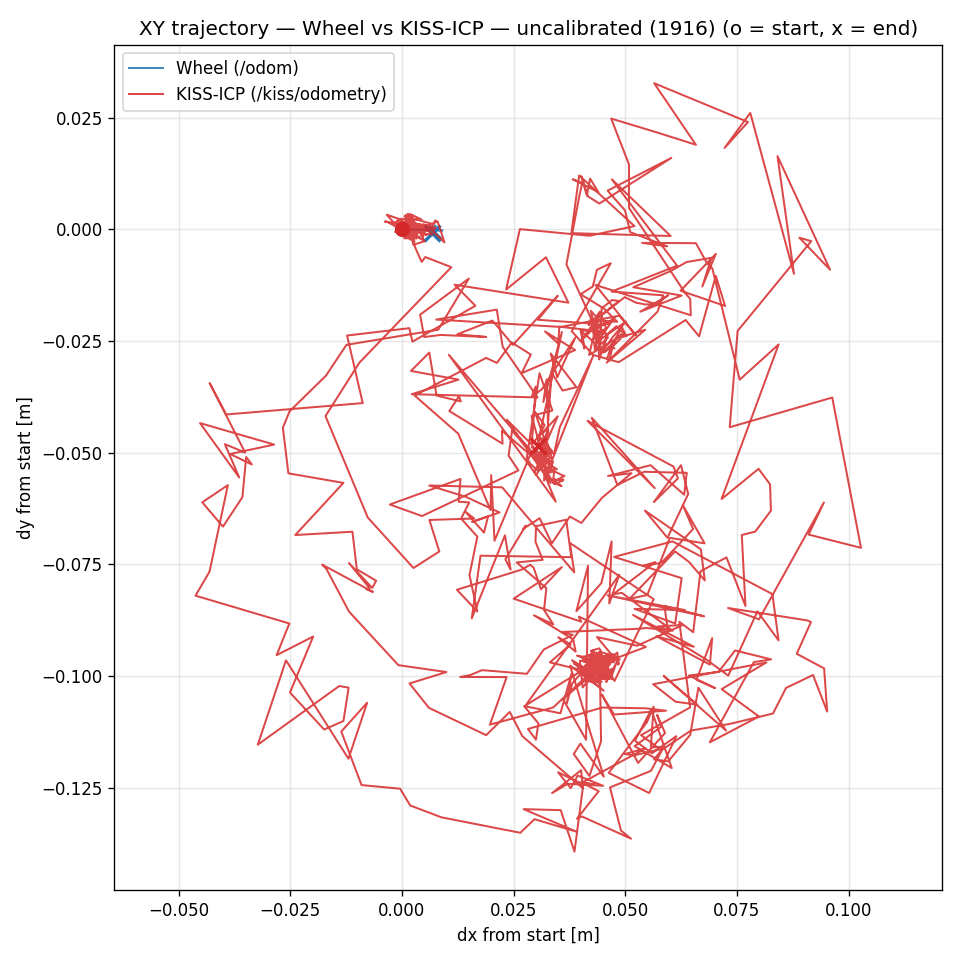

# 06. 評価・結果

[← 05. 歩行者検出](05_pedestrian.md) | [次: 07. 学んだこと →](07_lessons.md)

---

## 6.1 評価方針

このプロジェクトでは **「実機で動くか」が最終ゴール** だが、それを支える要素として以下を定量評価しました:

1. **SLAM 精度** — 純回転試験での yaw drift と XY drift
2. **計画タイミング** — STP4 計画レイテンシの分布
3. **自己フィルタ効果** — 自己点群除去率
4. **実環境走行** — 動画での挙動観察

---

## 6.2 SLAM 評価: 純回転試験

### 6.2.1 実験設計

- ロボットを定位置に置き、`/cmd_vel.angular.z` で **物理 720° × 2 = 合計 1440° 回転** させる
- 3 つの odometry (`wheel`, `kiss`, `ekf`) を同時に CSV ログ
- 走行終了後、`xy drift` (戻り位置誤差) と `yaw drift` (戻り角誤差) を計算
- 計 5 ラン (うち 1 ラン は KISS 死亡で除外)

### 6.2.2 結果サマリー (校正後 3 ラン)

**KISS-ICP**:

| ラン | yaw final drift | xy drift (final) | xy drift (max) |
|------|----------------|------------------|----------------|
| 1812 | -3.49° | 48.7 mm | 193.9 mm |
| 1825 | +1.24° | 50.5 mm | 174.8 mm |
| 1827 | +0.78° | 33.3 mm | 191.2 mm |

**統計**:

| 指標 | 値 |
|------|-----|
| yaw drift 平均 | -0.49° |
| yaw drift 標準偏差 | 2.6° |
| xy drift 平均 | 44.2 mm |
| xy drift 標準偏差 | 9.5 mm |

→ 1440° 回転後で **3.5° 以下の yaw 誤差**、**5 cm 以下の戻り位置誤差**。

### 6.2.3 グラフ

#### KISS-ICP の繰り返し再現性 (3 ラン重ね描き)




3 ランがほぼ重なっていることで、**run-to-run 再現性** が高いことが分かります。

#### 校正前/後の比較 (KISS)




#### 校正前/後の比較 (wheel)




校正前の wheel は **実回転と乖離した値** を返しているため、グラフからも校正後との差が読み取れます (詳しくは [03. SLAM](03_slam.md) §3.4 参照)。

#### 3 ソース重ね描き (校正前)




EKF (赤) が KISS (緑) にほぼ重なっており、wheel (青) はバイアスのため別の傾向を示しています。
これが「EKF の wheel 入力を切る」判断の根拠になりました。

---

## 6.3 計画タイミング (STP4)

### 6.3.1 計画レイテンシ分布

| 統計量 | 値 |
|--------|-----|
| 最小 | < 5 ms |
| 中央値 | 10 – 20 ms |
| 最大 | 50 ms 未満 (典型) |

**計画頻度 5 Hz (200 ms 周期) に対して十分な余裕**。

### 6.3.2 失敗ケースの内訳

| 失敗カテゴリ | 頻度 | 対処 |
|------------|------|------|
| タイムアウト | 稀 | キャッシュパスにフォールバック |
| 経路が見つからない (障害物に囲まれた) | 稀 | hold + 現在向き維持 |
| コストマップ構築エラー | 極稀 | 次サイクルで自動回復 |

---

## 6.4 自己フィルタの効果

### 6.4.1 点群数の比較

| 状態 | フレームあたり点数 |
|------|-----------------|
| 自己フィルタなし | ~1700 (静止ロボット周辺) |
| 自己フィルタあり | **600 – 800** |
| **削除率** | **~50%** |

### 6.4.2 検出への影響

| 対象 | フィルタなし | フィルタあり |
|------|------------|-------------|
| 自分自身の構造物 | 障害物として誤検出 | 削除 |
| 隣接歩行者 (距離 ~1m) | 検出 | **検出を維持** |
| 遠方の壁・柱 | 検出 | 検出 |

Z 上限 (LiDAR + 15cm 以下のみ削除) により、**歩行者の胴体・頭は残す** ことに成功しています。

---

## 6.5 走行デモ (動画)

<!-- TODO: GIF を assets/videos/ に配置したらここに埋め込み -->

### 実機: 静的環境での自律走行


- ウェイポイント間を自律で移動 (実機・屋内)
- KISS-ICP が安定して自己位置を出力
- 静的障害物 (柱・壁) を回避

### Sim: 歩行者回避 


- 環境: C++ (`pedestrians_moving` world)
- 歩行者が経路上に出現
- STP4 が「待機」を選択
- 歩行者が通り過ぎた後、元の経路を再開


### Sim ↔ 実機 (同一ノード構成)


- 同じ pegasus_node が Gazebo と実機で動く設計
- 実機展開のための共通基盤として機能

> ⚠ **注意**: 動的歩行者回避は現状 **シミュレーションでのみ検証** しています。実機での歩行者環境検証は今後の課題です。

---

## 6.6 キーメトリクス一覧 (採用面接ストック)

| 指標 | 値 |
|------|-----|
| LiDAR 点群サイズ | 230,400 points/frame |
| LiDAR スキャン頻度 | 10 Hz |
| KISS-ICP yaw drift (1440° 回転後) | < 3.5° |
| KISS-ICP drift rate | 0.05 – 0.24% / 1440° |
| KISS-ICP XY drift (戻り位置誤差) | < 60 mm |
| 計画レイテンシ | 5 – 50 ms |
| 計画頻度 | 5 Hz |
| **検出→予測 フルパイプライン (C++)** | **26.5 ms/frame** (p95 30.6) |
| **同上 (Jetson 実機, 12コア, 並列化後)** | **39.6 ms/frame** (並列化前 106.9, 詳細は [08_jetson](08_jetson.md)) |
| 検出レイテンシ (最適化後, C++) | ~13 ms (最適化前 152 ms) |
| 軌道予測レイテンシ (ONNX Transformer) | **0.56 ms/件** |
| 自己点フィルタ削除率 | ~50% |
| 巡航速度 (実運用) | ~0.5 m/s |
| ハード最大角速度 | ~0.55 rad/s |
| GPU 使用 | **なし** (CPU only) |

---

## 6.7 歩行者検出パイプラインの検証 (2026-06)

### 6.7.1 検出コアの妥当性確認 (KITTI)

SCOUT の検出コア (前処理 → DBSCAN → 32次元特徴 → Random Forest) を、
PeGASuS が従来用いてきた **KITTI データセット** (Tracking scene 0025) で動作確認:

| 項目 | 結果 |
|------|------|
| 検出フレーム | 各フレーム 3 – 5 名を歩行者として検出 |
| 可視化 | BEV (鳥瞰図) で人サイズのコンパクトなクラスタを確認 |
| 実行環境 | onnxruntime のみ (sklearn/conda 不要、CPU) |

→ 検出アルゴリズム本体が **既知データで妥当に動作** することを確認。
(注: これはアルゴリズムの健全性確認であり、SCOUT 実機での歩行者検出精度の評価ではない。)

### 6.7.2 自己改善ループの基盤構築 (誤検出削減)

実機録画に対し、**再学習せずパラメータ調整のみ**で誤検出を減らすための仕組みを整備:

```
録画 ─► 検出+追跡 ─► PNG 化 ─► (LiDAR 点群のみで) ラベル付け
                                         │
                                         ▼
              パラメータ掃引 (det 閾値・幾何/トラックフィルタ)
                  → 誤検出最小・再現率維持で評価
```

- 録画スクリプト (生点群 + オドメトリを固定保存)
- LiDAR 点群の多視点 PNG からの歩行者ラベル付けフロー
- 再クラスタ不要の高速パラメータ評価器 (適合率優先・再現率に下限)

→ 既存録画で検出 → 追跡 → ラベル用 PNG 生成まで通すことを確認。
パラメータ最適化の定量結果は **今後**。

---

## 6.8 検出→予測パイプラインの計測と最適化 (2026-07)

QT128 は **230,400 点/フレーム** と密。検出→追跡→予測の各段を実測し、ボトルネックを
特定して最適化した。

### 6.8.1 段別レイテンシと C++ 化

Python オフライン実装は全点ループが支配的。C++ 実装（実機ノード）では点群処理が激減し、
ボトルネックが **特徴抽出 (features)** に移る:

| 段 | Python | C++ |
|---|---|---|
| trim | 165 ms | 0.8 ms |
| grid_map | 398 ms | 10 ms |
| features (特徴抽出) | 210 ms | **140 ms** |
| deground / cluster | ~5 ms | ~1.5 ms |
| **合計** | ~778 ms | **152 ms** |

### 6.8.2 真因 — 1 個の巨大クラスタ

features 140 ms の **98% が 1 個のクラスタ (121,455 点 = 全点の約半分)** に費やされていた。
このクラスタは 0.59 m・後方左・小さな底面 (68 セル) に点が密集しており、地面除去で残った
自己構造/大型物体と考えられる。並列化 (OpenMP) は「1 クラスタ支配」のため無効だった。

### 6.8.3 最適化 — 点数キャップ

GetFeatures の前に「点数 > `cluster_max_points` のクラスタは分類をスキップ」を追加
（障害物としては引き続き扱われる）。

> **透明性のための訂正**: 当初キャップを 5,000 点に設定したが、これは **誤り** だった。
> 点数は近距離で急増し、実測で **0.6–1.1 m の実在歩行者が 5,000–17,506 点** に達する。
> 5,000 では歩行者判定クラスタの **16.5%（＝安全上最重要な近距離歩行者）を取りこぼす**。
> 歩行者判定の最大点数 17,506 を踏まえ **50,000（約 3 倍マージン）に修正**。全歩行者を
> 保持しつつ、病的な巨大ブロブ (121k) は引き続きスキップ。
> — 「最適化＝結果不変」を安易に断言せず、必ずデータで検証する教訓。

**結果**: C++ 検出 **152 ms → 12.8 ms（12 倍）**、features 145 → 2.6 ms（56 倍）。

### 6.8.4 フルパイプライン実測 (C++)

実機 `process_frame` に段別タイマを入れ、QT128 60 フレームで計測（warmup 除外）:

| 段 | 平均 |
|---|---|
| detect (trim/grid/cluster/壁フィルタ+読込) | 25.2 ms |
| classify (特徴+RF) | 0.94 ms |
| track (ByteTrack) | 0.03 ms |
| **predict (ONNX 軌道)** | **0.30 ms** |
| **合計 (検出→予測)** | **26.5 ms/frame** (p95 30.6) |

軌道予測は 1 件あたり **0.56 ms**（別途 2,102 件で計測、ONNX 0.25 + 前処理 0.31）。
**200 ms の計画予算に対し約 7.5 倍の余裕**。現ボトルネックは detect 段（壁フィルタ + 読込）。

### 6.8.5 距離 vs 分類スコア

近距離歩行者ほど点数が多く高スコア、遠方ほどスコアが落ちる。**検出可能性の包絡線
（距離ビン最大スコア）は 10 m 超で明確に低下**（16 m で 0.6 前後）。ただしスコアは距離
単独でなく **姿勢の影響が大きい**。この分析は「検出・追跡できた歩行者のスコア特性」であり
検出率ではない（生存者バイアスに注意）。

> 計測グラフ・検出/予測/BEV動画は付随の成果物として別途管理。

---

## 6.9 評価の限界 (透明性のため書く)

- **動的環境 (実機)** — 実機での歩行者検証は **未実施**。本ドキュメントの歩行者回避動画はすべて Sim
- **室内のみ** — 屋外では未評価
- **歩行者数 (Sim)** — Sim で 1 – 3 人での挙動確認。実機での検証は今後
- **長距離** — 数十メートル程度。100m+ ではループクロージャ不在の影響が出る可能性
- **絶対精度** — 物理基準との突き合わせは目視確認に依存

---

[← 05. 歩行者検出](05_pedestrian.md) | [次: 07. 学んだこと →](07_lessons.md)
