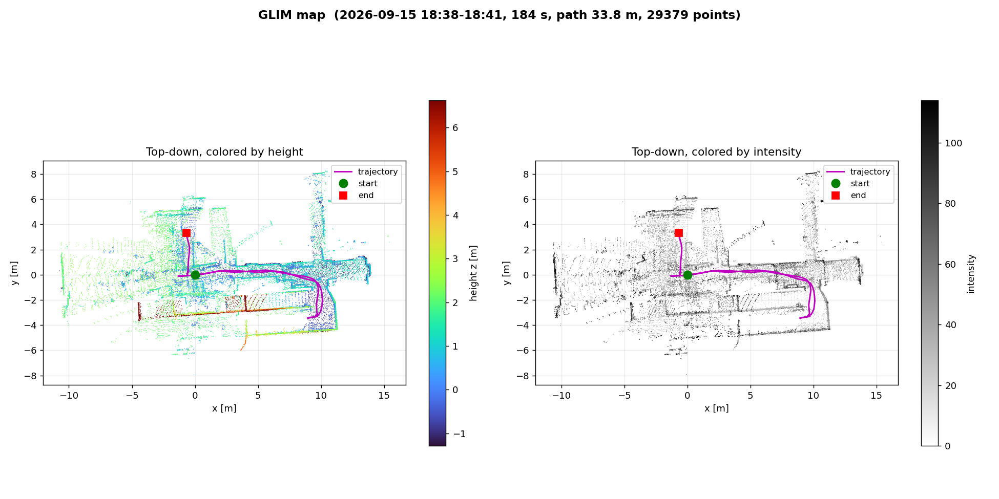

# 10. IMU 統合・GLIM 3D SLAM・事前地図ローカライゼーション

[← 09. DNN 検出](09_dnn_detection.md) | [目次に戻る →](../README.md) | [次: 11. 実機自律走行 →](11_field_navigation.md)

---

> 自己位置推定を KISS-ICP (LiDAR のみ・2D 地図) から **GLIM (3D LiDAR-IMU SLAM)** に移し、さらに **作った地図の上で自己位置だけを推定するローカライゼーション** を自作した記録。
> 途中で見つけた「GLIM が 10 Hz に追いつかない」問題の真因は、GLIM ではなく **DDS の配送** だった。実施期間: 2026-07 下旬〜10 上旬。

---

## 10.1 なぜ移行したか

[03. SLAM](03_slam.md) の KISS-ICP 構成には次の制約があった。

| 制約 | 影響 |
|---|---|
| 純回転で ICP が劣化しやすい | その場旋回の速度を 0.375 rad/s に抑えていた |
| 2D 地図 | 屋外の坂・段差を表現できない |
| 起動のたびに地図原点がリセットされる | **前回記録したウェイポイントを次回使えない** |

IMU を足し、3D の LiDAR-IMU SLAM である GLIM (GPU 版) に移すことにした。

---

## 10.2 IMU (Sony Spresense マルチ IMU) の統合

| 項目 | 内容 |
|---|---|
| 取り付け | LiDAR の真下、base_link と軸をそろえて水平に設置 |
| 座標の確認 | 静止時の重力の向きと、左旋回でジャイロ Z が正になることを実測で確認 |
| EKF への融合 | **ヨー角速度だけ** を融合。加速度は入れない |
| 取り付け誤差の校正 | その場旋回のジャイロ軸から、取り付けの傾き (pitch 1.83° / roll 0.73°) を推定して TF に反映 |
| ノイズの実測 | 15 分静止 (235 Hz・欠落 0) から Allan 分散でノイズ密度を算出 |

**加速度を EKF に入れて失敗した**: 一度入れたところ、静止していても位置が動き続けた。加速度計の小さなバイアスが 2 回積分されて位置のずれになる。位置は LiDAR に任せ、IMU は旋回の補間だけに使うことにした。

> **一言**: 設計書には「ヨー角速度 + 加速度を融合」と書いていたが、実機では加速度は害になった。**センサを足すほど良くなるとは限らない**。

GLIM の設定に入っていた IMU ノイズは、シミュレーション用の値のままで、実測より **数百〜2000 倍大きかった** (IMU をほとんど信用しない設定)。実測値に合わせて更新した (実走での効果は未確認)。

---

## 10.3 GLIM の実機稼働 (2026-09-15)

| 試験 | 結果 |
|---|---|
| 静止 70 分 | 57 分まで変位 **1 cm 未満** (57.5 分に一度だけ跳び、原因は未特定) |
| 手押し走行 184 秒 / 33.8 m | 壁が 1 本の線になり、往復の軌跡が重なる |
| 自律走行スタックへの統合 | 起動引数 `slam_backend:=glim` で KISS-ICP / EKF / slam_toolbox と GLIM を切り替え |

### 地図の「人の跡」を消す

GLIM の点群をそのまま 2D 占有格子に足していくと、後ろを歩く実験監督者が **軌跡状の黒い線** として地図に残った。占有格子を 2 層にした。

- **静的層**: GLIM のサブマップ (確定した地図) から作る
- **ライブ層**: 最新スキャンで log-odds を更新し、レイの手前のセルを空きにする。ロボットの周囲 6 m だけに重ねる

オフライン検証で、人の跡は 100% → 0%、壁は 100% 維持。歩行者の回避は地図ではなく検出 ([09 章](09_dnn_detection.md)) で行うため、動く人が地図に載らないのは意図どおり。

その後、屋根の下が縞になる問題が出た。原因は高さを **地図座標の絶対値** で切っていたことで、坂や z のずれで床や屋根が帯に入っていた。点ごとに **地面からの高さ** に直す方式に変えた (実機での再確認は未了)。

---

## 10.4 「GLIM が遅い」の真因は DDS だった

GLIM は 10 Hz の LiDAR に対して **6.7 Hz** しか処理していないように見えた。GLIM の設定を軽くしても回復しなかった。

| 観察 | 解釈 |
|---|---|
| ドライバは 10 Hz・パケット欠損 0.007% で送っている | 送信側は正常 |
| 受信側の間隔が 100 / 200 / 300 ms の倍数 | フレームが **丸ごと** 落ちている |
| 購読プロセスごとに落ちるフレームが違う | **配送** で落ちている |

1 フレーム 2.8 MB の点群が、Fast DDS 既定の共有メモリセグメント (512 KB) に入らず、64 KB 単位の UDP に分割されていた。BEST_EFFORT の購読者は分割の 1 つが欠けるとフレーム全体を失う。

| 設定 (2.8 MB × 10 Hz の合成試験) | 届いた割合 |
|---|---:|
| 既定 | 39% |
| LARGE_DATA モード | 61% |
| **共有メモリ 64 MB + UDP 8 MB のプロファイル** | **100%** |

プロファイルは **送信側** のセグメントで決まるため、受信側だけでは効かない。全ノードに適用する設定にした。なお `ros2 topic hz` はこの機体では負荷で大きく低く出るので、到着数を数える専用ツールを作って測った。

その後、DDS を直したことで GLIM 自体の処理 (8.7 Hz) が見えるようになり、遅れが溜まる (9 分で 72 秒) 問題が出た。到着遅延を見るツールで切り分け、GPU が張り付いていたため設定を軽くして **10.0 Hz・遅延 0.27 s で一定** になった。入力を 5 Hz に間引く案は GLIM が発散したため却下した。

> **一言**: 「処理が遅い」と見えたら、まず **入力が全部届いているか** を測る。そこを確かめずに重さを議論していた。

---

## 10.5 事前地図ローカライゼーション (自作)

GLIM には「保存した地図の上で自己位置だけを推定する」モードが無い。GLIM の拡張モジュールとして自作した。GLIM はオドメトリだけを担当し、モジュールが地図と照合して `map → odom` を出す。これで地図座標がセッションをまたいで固定され、**ウェイポイントを再利用できる** ようになった。

| 項目 | 内容 |
|---|---|
| 照合 | VGICP でスキャンと地図を合わせる |
| 状態 | `WAIT_INIT` / `TRACKING` / `DEGRADED` / `LOST` |
| 初期位置 | 前回の終了位置 → マッピング終了位置 → 地図原点の順に試す。だめなら地図をクリックして指定 |
| シミュでの精度 | 53.9 m 走行で 平均 7 mm / 最大 10 mm、ヨー最大 0.084° |

### 失敗から入れた工夫

| 失敗 | 対策 |
|---|---|
| 誤った姿勢でも inlier 率が 0.99 になる (地面の点が大半を占めるため) | 壁・柱など **水平でない点だけの一致率** で判定 |
| 正方形の部屋で 90° / 180° ずれた解に収束する | 起動時の探索範囲を ±0.5 m / 15° に絞り、範囲外の解は捨てる |
| 実機ではクリック位置が 6〜10 m ずれ、±1 m の窓で全部棄却 | 2D の構造ラスタ相関で 5 m / ±45° を粗く探索 → 上位 6 候補を VGICP で詰める。3〜4 m / 30〜40° ずれから **12/12 復帰・0.8 s** |

### 操作アプリとの統合

操作アプリから「Localization」「New Map」「Save Map」を切り替えられるようにした。GLIM は監視プロセスの子として動かし、指示で再起動する。

- GLIM が再起動したら自動走行を止める
- `TRACKING` になるまで自動走行を受け付けない (再起動直後は、他ノードの TF に前のセッションの値が残っていて正しく見えてしまうため)
- 地図は上書きしない (同名があれば日時付きの別名で保存)。実際に、地図を一度上書きして失った事故から入れた

2026-10-04 に、この事前地図ローカライゼーションの上で **実機の自律走行に成功** した ([11 章](11_field_navigation.md))。

---

## 10.6 進行中・残課題

| 項目 | 状態 |
|---|---|
| GNSS (GSX2) の融合 | ローカライザにカイ二乗ゲート付きで融合する処理を実装し、オフラインテストは合格。**屋外で測位 (Fix) できておらず未検証** |
| 地図の緯度経度の対応付け | 対応付けファイルの作成ツールが未実装 (無い地図では GNSS は使われない) |
| `LOST` でプランナを止める | 未実装 |
| 位置の鮮度の監視 | 走行側は TF が取れるかしか見ておらず、時刻の古さを見ていない。GLIM が止まっても気づけない可能性がある (コードを読んでの判断、未実測) |
| 長い走行での z のずれ | 18 m で地面が +3 m 上がった事例あり。IMU ノイズ設定が原因の候補で、設定を更新済み・実走で未確認 |
| 地図の拡張 | 「既存の地図に新しい区画を継ぎ足す」設計案まで (保留) |

---

[← 09. DNN 検出](09_dnn_detection.md) | [目次に戻る →](../README.md) | [次: 11. 実機自律走行 →](11_field_navigation.md)
