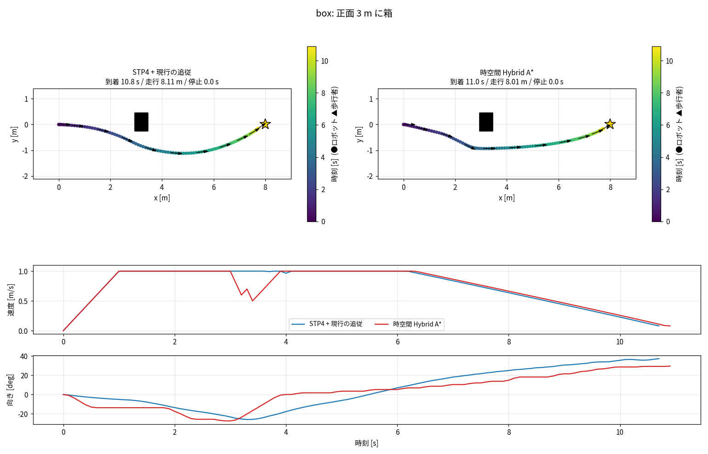
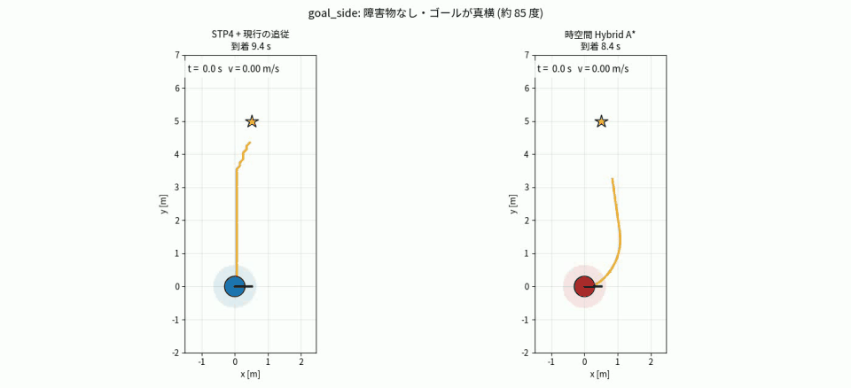
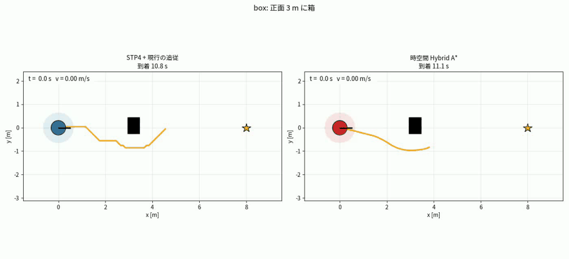
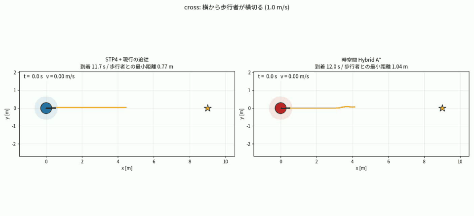
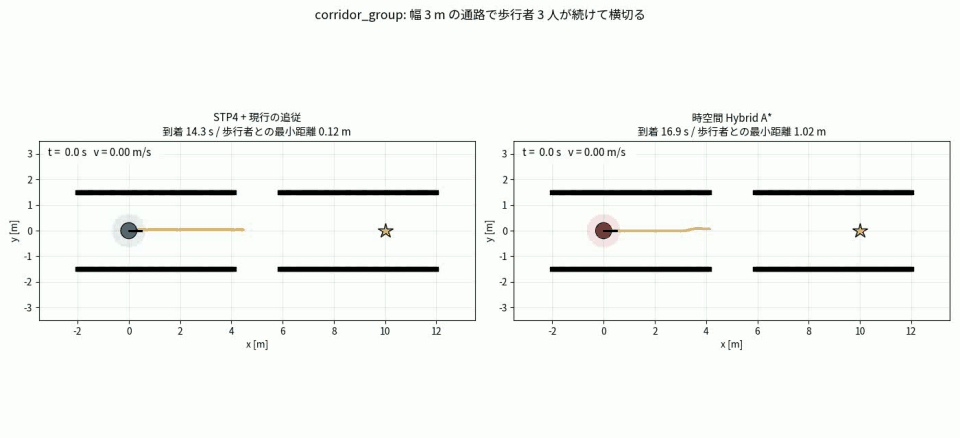
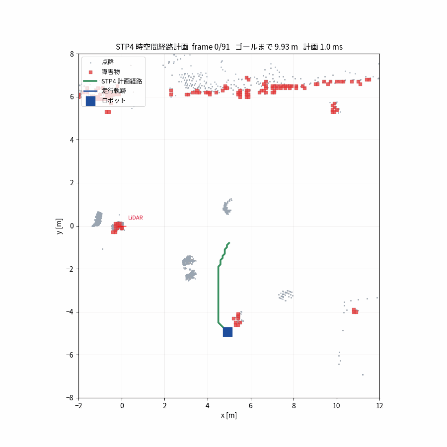
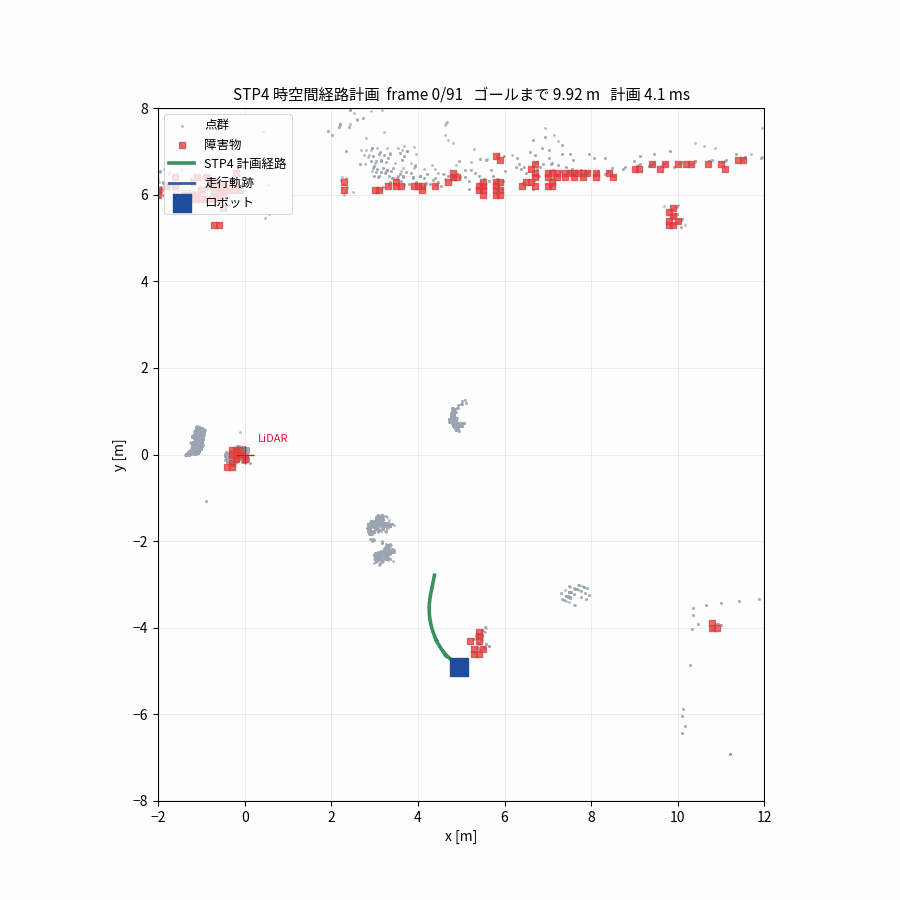

# 12. 時空間 Hybrid A* — 向きと時間を同時に扱う経路計画

[← 11. 実機自律走行](11_field_navigation.md) | [目次に戻る →](../README.md)

---

> STP4 ([04 章](04_planning.md)) の後継として、**状態に向きを持ち、旋回や加減速にかかる時間を探索の中で数える** 局所プランナを作った記録。
> 「待つ」をノードにせず **出発の遅延** で表すことで状態の爆発を抑え、Jetson 上で全ての計画を **42 ms 以下** に収めた。
> 合成シナリオと実機の記録データで STP4 と比較し、切替式で実機スタックに搭載した (実機走行は未実施)。実施日: 2026-10-06。

---

## 12.1 何が問題だったか

STP4 は (セル, 時刻) のグリッド探索で、歩行者の予測を「未来の障害物」として扱える。しかし実機で走らせると、**まっすぐ進むか、止まってその場で回るか** の動きになった。原因は 3 つある。

| 問題 | 何が起きるか |
|---|---|
| 進路が 0° / 45° / 90° しかない | 浅い角度のゴールは「直進してから階段」、障害物は「直進してから遅く避ける」経路になる |
| 向きを持たない | 差動駆動の 90° 転換 (4.19 s) をコスト 0 と見なす。計画が「t + 1 層で着く」と思ったセルに実機は t + 43 層で着き、時空間の推論が崩れる |
| 発進・停止の時間を持たない | 停止状態から「歩行者の前を抜けられる」と判断し、実際は加速が間に合わず進路上で止まる |

3 つめは合成シナリオで実際に起きた。通路で 3 人が続けて横切る場面で、STP4 は歩行者と **0.12 m** まで近づいた。

左の STP4 は追従が角を内側に切り、右は出だしから斜めに進んで箱から 0.73 m を保つ。

---

## 12.2 検討した案と選ばなかった理由

| 案 | 内容 | 結論 |
|---|---|---|
| STP4 に向きを足す | 向きを親ノードから導き、向きが変わるときにステップを課金 | 階段経路の 0° / 45° の往復すべてに課金され、斜めの進路がさらに減る。**取り下げ** |
| SIPP + 向き | 時間を「安全区間」で持つ | 待つか迂回するかの判断は残せるが、ソフトコストの扱いに工夫が要る。考え方だけ採用 |
| 経路と速度の分離 (s-t 平面) | 2D 経路の候補ごとに速度を最適化 | 「待つか迂回するか」を 1 回の探索で決められない |
| **時間付き Hybrid A*** | 状態 (x, y, θ, t) で弧のプリミティブを探索 | 斜め・旋回半径・旋回時間が全部探索に入る。状態が増えるので、速さは作って測る必要がある。**採用** |

> **一言**: 「向きを足す」だけなら STP4 の改修で済むと思っていたが、階段経路に旋回コストを課すと **逆効果** だった。経路の形を変えるには位置の表現から変える必要があった。

---

## 12.3 探索の構造

### 状態と重複判定

- 状態は (x, y, θ, t) の **連続値**。各ノードは到着した実際の姿勢を持ち、次の動きはそこから伸ばす。グリッドは衝突判定と重複判定にだけ使うので、位置の丸めは積まない。
- 重複判定は (セル 0.1 m, 向き 5°)。時刻はビンに切らず、後述の「支配」で扱う。
- 向きの刻みは、弧 1 本で変わる向き (0.2 m ÷ 1.67 m = 6.9°) より細かくないといけない。10° にすると弧と直進が同じ区切りに入って弧が捨てられ、障害物を避けられなくなった (実測)。

### プリミティブ

| 動き | 速度 | 時間 | 意味 |
|---|---|---|---|
| 直進 0.2 m | 1.0 m/s | 0.2 s | 巡航 |
| 低速直進 0.2 m | 0.5 m/s | 0.4 s | 止まらずに減速して人をやり過ごす |
| 弧 R = 1.67 m | 1.0 m/s | 0.2 s | 走りながら曲がる (角速度の上限 0.6 rad/s) |
| きつい弧 R = 0.8 m | 0.48 m/s | 0.42 s | 速度 = 角速度の上限 × R。きつく曲がるほど遅い |
| その場旋回 15°〜180° | 0 | 角度 ÷ 0.375 rad/s | 単発のみ。動いていればまず直進で止まる |

**旋回の時間コストは、角速度の上限からそのまま出る**。パラメータは追従側と同じ値なので、計画と実機の時間軸が一致する。

### 待機 = 出発の遅延

最初は「0.2 s 待つ」をプリミティブにしていた。すると、進路が塞がれたときに「ここで 0.4 s 待ってから進む」「0.2 m 進んでから 0.2 s 待つ」「向きを変えてから待つ」など、同じ結果になる待ち方の組み合わせが全部別のノードになり、通路で **18,000 ノード・200 ms** を超えた。

時間がコストの探索では「同じ場所・同じ向きなら、早く着いた方が常に有利」である (早く着いた方は、そこで待てば遅く着いた方と同じ状態になれる)。この性質を使い、待機を **移動の出発を遅らせる** ことで表した。

1. 各移動について、まず **今すぐ出発** を試す。通れば待たない。
2. 通らなければ **出発を遅らせる**。親が動いていればまず直進で止まり (減速度 2 m/s²)、止まった位置で待つ。移動の軌道を「通るセル + 出発からの時間ずれ」の列にしておき、出発時刻を 0.1 s 刻みで遅らせながら、セルごとの **層ビットマスク** (49 ビット) で「待つ場所が空いているか」「軌道の各セルがその時刻に空いているか」を調べる。
3. 最初に通った出発時刻を採用する。待つ場所自体が塞がれるなら打ち切る。

マスクの判定はビット演算だけなので、出発時刻を 48 通り試しても軽い。

### 支配 (dominance)

同じ (セル, 向き) に着いたノード A, B について、次が揃えば B を捨てる。

- A の到着 + 発進の遅れ (A の速度 → B の速度) ≤ B の到着
- A の罰則 (時間以外のコスト) ≤ B の罰則 + 0.3 s
- A の到着から B の到着まで、そのセルが空いている

速度の項を入れる前は、「0.5 m/s で早く着く」が「1.0 m/s で 0.05 s 遅く着く」に勝ち、ロボットがゆっくり発進する計画になった。

### 加減速の扱い

速度は状態に持たない。代わりに、親プリミティブの速度 v₀ から時間を課金する。

- 速くなる (v₀ → v): 発進の遅れ (v − v₀)² ÷ (2·a·v) だけ、その場に留まってから進む
- 止まる (v₀ → 0): v₀² ÷ (2·d) だけ直進で空走してから、待つ / 回る

これが無いと、停止状態から「歩行者の前を抜けられる」と判断して進路上で止まった (12.1 の 3 つめ)。

### ヒューリスティック — 無いと壊れた 3 点

| 要素 | 無いときに起きたこと |
|---|---|
| **向きの項** (ゴールまでの「弧 + 直線」の所要時間) | 直進 1 本と弧 1 本で h の減りがほぼ同じになり、直進してから遅く曲がる |
| **任意角の距離場** (ゴールから Theta* を回し、タウトな経路の曲がり点を持つ) | 8 / 16 近傍の Dijkstra 表では、障害物の周りの階段経路が全部同じコストになり、障害物に直進してから避ける |
| **発進の遅れの加算** (今の速度から巡航までの遅れを h に足す) | 「ゆっくり発進」が「巡航で発進」より安く見えて、先に展開される |

> **一言**: 探索の骨組みより、**ヒューリスティックの形** が経路の見た目を決めた。3 点とも、合成シナリオの軌跡を見て初めて気づいた。

### 終了と部分解

ゴール半径 0.25 m に入れば成功。届かないときは、移動を地平 (4.8 s) で切り、地平に達したノードが最初に pop されたものを部分解にする。予算 40 ms を超えたら、そこまでで h が最小のノードを使う。

---

## 12.4 速さをどう出したか

目標は「Jetson 上で 1 回の計画 50 ms 以内」。ヒューリスティックの重みだけでは足りなかった。

| 重み | 通路で 3 人横断 (平均 / 最大) | 副作用 |
|---|---|---|
| 1.0 | 50 ms / 206 ms | — |
| 1.5 | 34 ms / 206 ms | — |
| 2.0 | 31 ms / 204 ms | 遅い歩行者の後ろを付いていき、到着が 12.9 → 17.7 s |
| 3.0 | 16 ms / 130 ms | 同上 |

進路が塞がれた場面では、重みを上げても最大値が下がらない (待ち方の組み合わせが増える)。そこで探索の作りを 3 か所直した。

1. **待機を出発の遅延に** (12.3) — 待ち方の組み合わせが消える
2. **支配で時間のビンを廃止** — 同じセル・向きに早く着いたノードが遅いノードを吸収する
3. **その場旋回を単発にし、マスクで一括判定** — 15° × 連鎖で向きのビン数だけ状態が増えていた。プロファイルでは 90° 旋回 (40 サンプル) × 15 種類の衝突判定が最大の負荷だった

結果、展開ノード数は最大 18,000 → 5,000、重み 1.5 で **合成 9 シナリオ 1,110 回の計画が全て 42 ms 以下** になった。

| 場面 | STP4 (平均 / 最大) | 時空間 Hybrid A* (平均 / 最大) |
|---|---|---|
| 障害物なし | 0.5 / 2.7 ms | 3.0 / 4.7 ms |
| 歩行者が横切る | 5.3 / 84 ms | 4.6 / 14 ms |
| 通路で 3 人横断 | 8.2 / 28 ms | 11.4 / 42 ms |
| **実機の記録データ** (横断シーン, 平均 7.8 人) | 1.4 / 8.4 ms | 5.3 / 10.3 ms |

開けた場面は固定処理 (グリッド・距離場・マスク) のぶん STP4 より遅く、塞がれた場面は展開数が 50 分の 1 で最大値が小さい。1 ノードあたりは約 10 µs (STP4 は 1 µs 未満) で、連続値の姿勢・三角関数・ハッシュ表のぶん重い。

---

## 12.5 結果 (合成シナリオ, STP4 + 現行の追従との比較)

歩行者は台本どおりの等速で動き、予測は理想値。ロボットは差動駆動モデル (加速度制限あり) で、巡航 1.0 m/s・10 Hz 再計画。比較相手の追従は pegasus_node の追従を簡略に写したもの。

| シナリオ | STP4 | 時空間 Hybrid A* |
|---|---|---|
| ゴールが真横 (85°) | 到着 9.4 s、**停止旋回 1.2 s** | 到着 **8.2 s**、止まらず弧で曲がる |
| 正面 3 m に箱 | 10.8 s、箱との距離 0.50 m | 11.0 s、**0.73 m** |
| 歩行者が横切る | 11.7 s、最小距離 0.77 m | 11.8 s、1.04 m |
| 正面から歩行者 | 12.7 s、0.88 m | 12.7 s、1.08 m |
| 通路で 1 人横断 | 13.7 s、1.08 m | 13.4 s、1.06 m |
| **通路で 3 人横断** | 14.3 s、**0.12 m (安全半径 0.65 m の内側に 1.5 s)** | 16.6 s、2.0 s 待って **1.04 m** |

### 動画

左が STP4 + 現行の追従、右が時空間 Hybrid A*。●がロボット、緑●が歩行者、破線の円は安全半径、オレンジの線がそのときの計画。

**真横のゴール** — 左は止まってその場で回ってから走る。右は走りながら曲がる。

**正面の箱** — 右は出だしから斜めに進み、角で止まらない。

**横断する歩行者** — 左の計画 (オレンジ) は階段状、右は滑らかな弧。

**通路で 3 人が続けて横切る** — 左は 6 s 付近で歩行者と重なる。右は減速して止まり、待っている間に向きを変え、全員が通ってから進む。

### 実機の記録データ

LiDAR の記録 (横断シーン, CenterPoint 検出 + 軌道予測) の中を仮想ロボットが走る。左が STP4、右が時空間 Hybrid A*。

| STP4 | 時空間 Hybrid A* |
|---|---|
|  |  |

---

## 12.6 搭載 — いつでも戻れる形で

- 起動引数 `planner_algo:=ST_HYBRID` で切り替える。**既定は STP4 のまま** で、指定しなければ搭載前と同じコードを通る。
- コストマップの構築は STP4 と共通 (同じ関数の中で分岐)。失敗時は STP4 と同じく 2D A* にフォールバックする。
- 制御は「毎 tick 再計画し、計画の最初の指令 (v, ω) をそのまま出す」。先読み点と方位 P 制御は通らない。終点手前の減速は同じ式を適用する。
- 搭載前の作業ツリーにタグ `pre-st-hybrid` を打った。
- 単体テストで、通路でのゴール到達と「横切る歩行者に対して計画が実時間で安全半径を保つ」ことを確認する。

---

## 12.7 限界と次

- **実機未走行**。確認すべきは (1) 指令をそのまま出す追従で蛇行しないか、(2) 加速度・減速度の実測値 (見積もりがずれると「歩行者の前を抜ける」判断が狂う)、(3) CenterPoint・GLIM と同時に動いたときの計画時間。
- 停止中に歩行者が自分の位置へ来たときに逃げる動きは無い。
- 支配の罰則許容 0.3 s は近似で、最適でない解になることがある。
- 加速して先に抜ける動きは **意図して入れていない**。譲る判断が外れても数秒遅れるだけだが、加速して抜ける判断が外れると速度を上げた状態で人と交差する。ロボットは速度を上げず、譲るか迂回するだけとした。

> **一言**: 「速くなったが正しいか分からない」を避けるため、改修のたびに合成シナリオ 9 本の到着時間・最小距離・計画時間を見直した。経路の形と待つ判断は、数字より **動画で見たときの違和感** から直した箇所が多い。

---

[← 11. 実機自律走行](11_field_navigation.md) | [目次に戻る →](../README.md)
